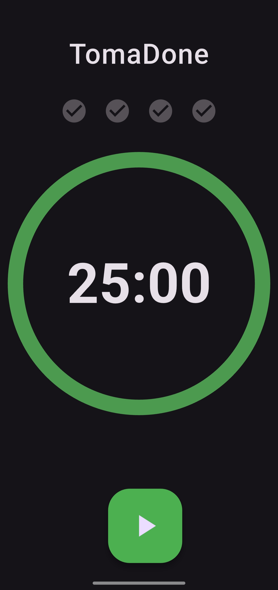
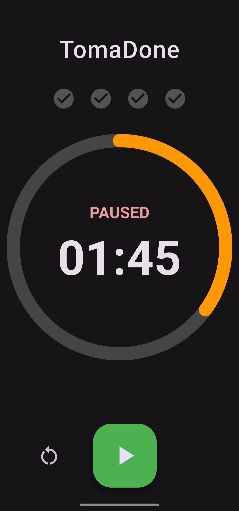
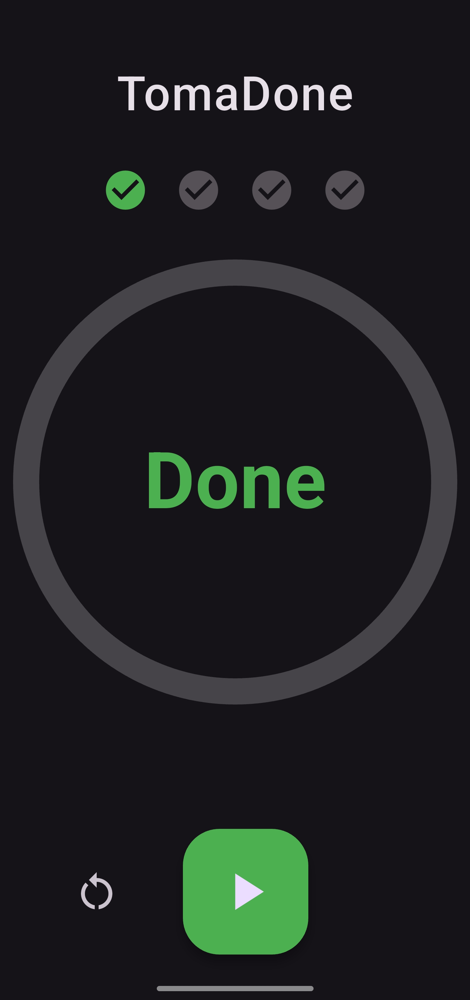

# 🍅 TomaDone

A simple, beautiful, and effective Pomodoro Timer built with Flutter. This app helps you stay focused and productive by breaking down your work into manageable 25-minute sessions.

<div>
  
  
  
</div>

## ✨ For Users

Welcome! This app is designed to be your personal focus companion.

### Features

-   **⏲️ 25-Minute Sessions (default):** Classic Pomodoro technique timer. But you can adjust.
-   **📊 Progress Tracking:** A visual tracker for your completed Pomodoro sessions (up to 4).
-   **🎨 Minimalist Design:** Clean, distraction-free UI with Material 3 design.
-   **🌗 Light & Dark Mode:** Automatically adapts to your system's theme.
-   **▶️ Simple Controls:** Easy-to-use play, pause, and reset functions.

### How to Use

1.  **Start:** If you want to change the duration - swipe the minutes up or down (from 5 to 95 minutes). Press the large ▶️ button to begin a focus session.
2.  **Focus:** Work on your task without distractions until the timer finishes.
3.  **Finish:** When the timer hits `00:00`, you'll see a "Done" message, and a checkmark ✅ will be added to your session tracker.
4.  **Pause:** If you need to interrupt a session, press the ⏸️ button.
5.  **Reset:** While paused or finished, press the 🔄 button to reset the current session's progress.

---

## 👨‍💻 For Developers

This project is a straightforward Flutter application demonstrating state management, custom UI, and async operations.

### Technical Stack

-   **Framework:** [Flutter](https://flutter.dev/)
-   **Language:** [Dart](https://dart.dev/)
-   **Design:** [Material 3](https://m3.material.io/)

### Getting Started

1.  **Clone the repository:**
    ```sh
    git clone <repository-url>
    cd tomadone
    ```

2.  **Install dependencies:**
    ```sh
    flutter pub get
    ```

3.  **Run the app:**
    Connect a device or start an emulator, then run:
    ```sh
    flutter run
    ```

### Project Structure

-   `lib/main.dart`: The single entry point and main screen for the application. Contains all UI and business logic.
-   `android/`: Android-specific project files.
-   `ios/`: iOS-specific project files (not configured yet... ).